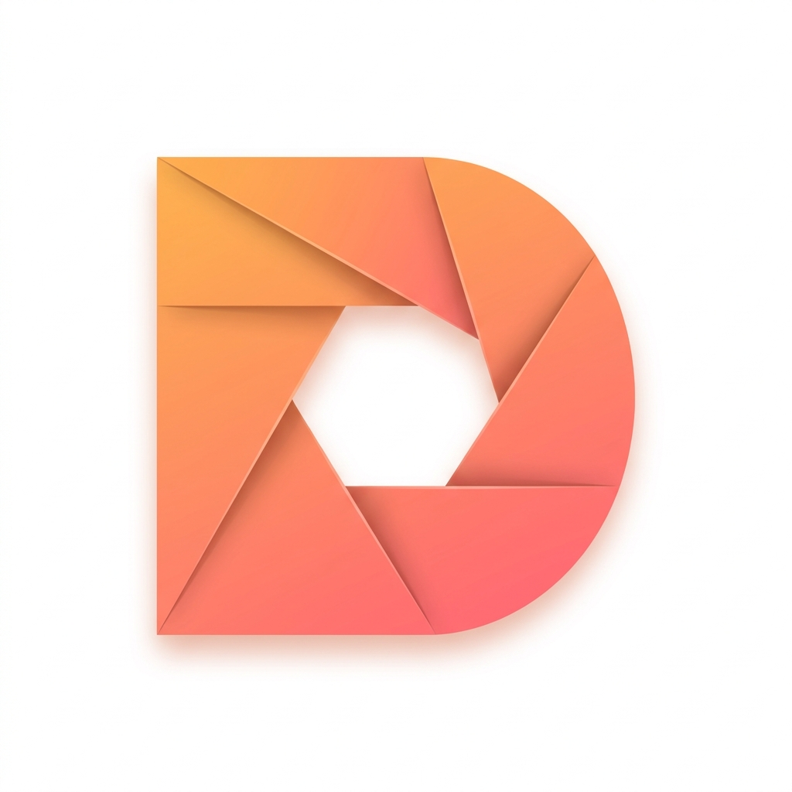

# 下载地址

> 用代码塑造生活：咕咚同学的数字实验室

感谢您的驻足！这里展示的应用，是我利用业余时间独立开发和维护的。它们诞生于解决我个人生活中遇到的实际问题，因此，我保证所有应用永无后台、永无广告。

它们只专注于将一个功能做到极致，如果您认同独立开发者的精神，并追求简洁、纯粹、高效的工具，请放心下载，与我同行。

|  | 应用 | 简介 | 下载 |
| --- | --- | --- | --- |
|  | [inBox 笔记](/inbox/) | 记录灵感、想法的本地化笔记软件（手机端） | [下载地址](https://www.pgyer.com/app/install/6a195ff51fe902a120fcda1303fb0137) |
|  | [inBox 笔记（桌面版）](/inbox/) | Windows / macOS / Linux 桌面端，含网页版 | [前往下载](https://inbox.gudong.site/#/) |
|  | [点亮习惯](/light) | 成为更好的自己，极致简单的习惯打卡软件 | [下载地址](https://www.pgyer.com/app/install/3db7b5b3b01f09c85934fdb19f1da92b) |
|  | [仓咚咚](/cang) | 让资产一目了然，简单易用的资产管理软件 | [下载地址](https://www.pgyer.com/app/install/bf8dbdf68ee1cf0906813d136b1a4d74) |
|  | [咕咚订阅](/rssplus) | 个性化我的信息源，简洁实用的 RSS 订阅软件 | [下载地址](https://www.pgyer.com/app/install/99503fd847173ed64a1522df51d66658) |
|  | [咕咚云图](/picplus) | 图床上传 APP，生成 Markdown 链接，兼容主流图床与 GitHub/码云 | [下载地址](https://www.pgyer.com/app/install/e35e31620ac6476c1e442e6ef72694af) |
|  | [inVoice 语记](/voice) | 简单好用的录音工具，支持 AI 智能转写 | [下载地址](https://www.pgyer.com/app/install/f1476b43a1f8980eadc61f88681bc6ed) |
|  | [PassBox](/passbox) | 极简离线密码管理器，本地存储不联网 | [下载地址](https://www.pgyer.com/app/install/c7feda00ffb8c14ef26768a5dda0819d) |

<!-- 已隐藏 — 后续可恢复
|  | [小牛说](/niushuo) | AI 驱动的语音输入法，打字不用敲，就用小牛说 | [下载地址](https://www.pgyer.com/app/install/7856141f76eee28f17ae19b6b091ef1f) |
|  | [图咚咚](/tudongdong) | 简单易用、高颜值的全能本地图片处理工具箱 | [下载地址](https://www.pgyer.com/app/install/449fe465df1eb30c8aebc0e989b4a41d) |
|  | [声咚咚](/audio) | 让声音随心所欲，简单易用的全能音频工具箱 | [下载地址](https://www.pgyer.com/app/install/586fe4bb0e736b133c01bd313af47a30) |
|  | [咚时光](/time) | 为宝宝记录每一个珍贵时刻的成长记录软件 | [下载地址](https://www.pgyer.com/app/install/51403673fc46a16d71dab3c8947a1295) |
|  | [EchoRead](/echo) | AI 驱动的个人知识管理，把好内容复刻成脑资产 | [下载地址](https://www.pgyer.com/app/install/92cb6c457e756d2f8cc6545d222562bd) |
-->

---

## 💬 加入用户交流群

每个 App 都有对应的用户群。如果你想了解最新动态、获取使用帮助、或者给我提产品建议，欢迎加我微信，备注你使用的 **App 名称** 即可进群。

  
   
  <strong>微信：mw08032231</strong>
   
  👆 扫码加我，备注 App 名称进群

