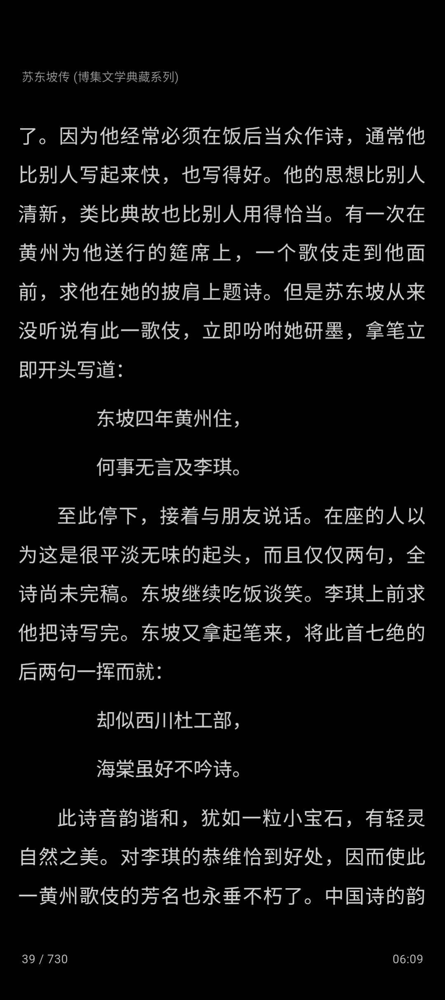

# 书咚咚

> 本地优先的 EPUB 阅读器，安静读书这一件事。

书咚咚（ShuDongDong，暂用名）是一个本地优先的 EPUB 阅读器：把书导进来，横滑翻页，安静读完。它不社交、没有推荐流、不打断——工具收起来，只在需要时出现。

一些功能特性：

- **本地书架** — EPUB 一键导入，封面与作者信息自动解析
- **横滑翻页** — 交互参考纸质书，手势留在正文里；支持音量键翻页（Android）
- **划线与想法** — 波浪线/直线/背景色三种样式五色可选，一条划线可追加多条想法
- **书摘分享** — 划线一键生成金句卡片，分享微信好友或朋友圈
- **目录与搜索** — 章节目录跳转，全书全文搜索
- **排版可控** — 字号、行距、页边距，内置思源宋体与霞鹜文楷双字体，五色皮肤
- **进度与书签** — 自动记录阅读进度，随手加书签
- **读书印记** — 今日阅读时长、连续天数、近 7 日足迹，全部本机统计
- **本地优先** — 无账号、无云端、无广告，书和进度都存本机，断网完整可用

## 一些其他链接

- [使用指南](guide.md)
- [功能详解](features.md)
- [常见问题](qa.md)
- [更新日志](changelog.md)
- [联系我们](contact.md)

## 平台

- Android
- iOS（macOS 规划中）

## 下载地址

[去下载](/download)

## 反馈

通过 App 内「我的 → 关于」页反馈，或查看 [联系我们](contact.md)。

> 名称说明：书咚咚为暂用名，正式名称确定后本页同步更新。
