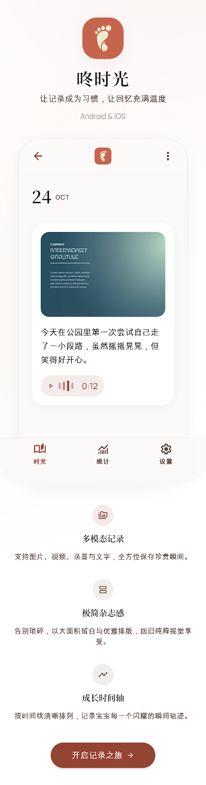

# 咕咚时光

<!-- TODO: 补充本地 icon -->
<!--  -->

> 为宝宝记录每一个珍贵时刻

咕咚时光（咚时光）是一个本地优先的宝宝成长记录应用，帮助父母用文字、照片、视频和音频记录宝宝的每一个成长瞬间，以时间线的形式重温美好回忆。

一些功能特性：

- 本地优先，数据安全可控，无需注册即可使用
- 支持文字、图片、视频、音频多类型记录
- 时间线浏览，卡片与轨道两种布局
- 多宝宝管理，轻松切换
- 数据导出与导入，换机无忧
- 精美设计，支持浅色与深色模式
- 支持 Android、iOS、macOS 多平台

## 一些其他链接

- [使用指南](guide.md)
- [常见问题](qa.md)
- [更新日志](changelog.md)
- [账号与登录](account.md)
- [联系我们](contact.md)

## 下载地址

<!-- TODO: 补充下载链接 -->
即将上线，敬请期待。
