# 永久独立版配置指南

## 为什么需要配置？

永久独立版是一个完全独立运行的版本，所有云端服务（语音转写、AI 功能）均使用你自己配置的密钥，不依赖官方服务器额度。因此在使用前，需要完成以下两项服务的配置：

1. **语音转写**（阿里云 NLS）— 录音转文字功能依赖此服务
2. **AI 引擎**（DeepSeek / GLM / 自定义）— AI 润色、智能标题等功能依赖此服务

配置完成后，App 的所有功能即可正常使用，所有算力由你自己的账号提供，无额度限制。

预计耗时：约 15 分钟。

---

## 一、配置语音转写（阿里云 NLS）

语音转写使用的是阿里云「智能语音交互」服务。你需要完成两件事：获取 AccessKey 和创建 NLS 项目。

### 1.1 前置准备

- 拥有[阿里云账号](https://www.aliyun.com)并完成**实名认证**
- 实名认证在阿里云账号设置中完成，按提示操作即可

### 1.2 创建 RAM 子用户并获取 AccessKey

为了安全，建议创建一个专用的 RAM 子用户，而非直接使用主账号的 AccessKey。

**第一步：打开 RAM 控制台**

访问 [https://ram.console.aliyun.com](https://ram.console.aliyun.com)，在左侧导航栏选择「身份管理 > 用户」，点击「创建用户」。

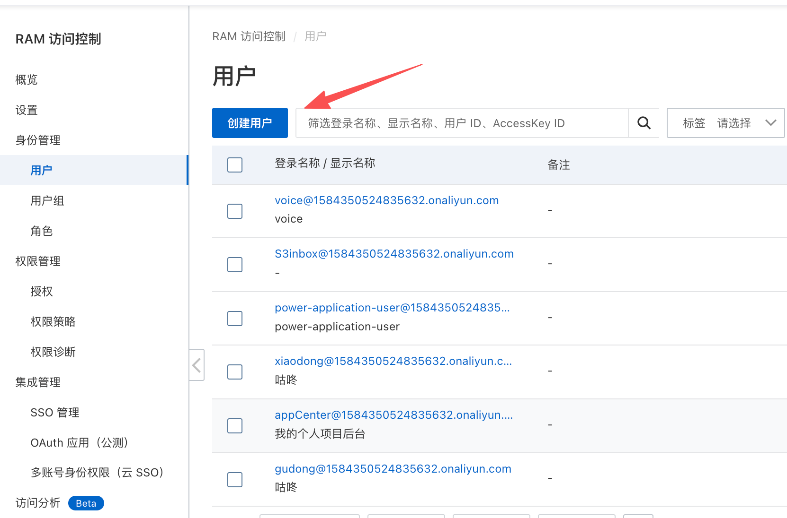

**第二步：创建 AccessKey**

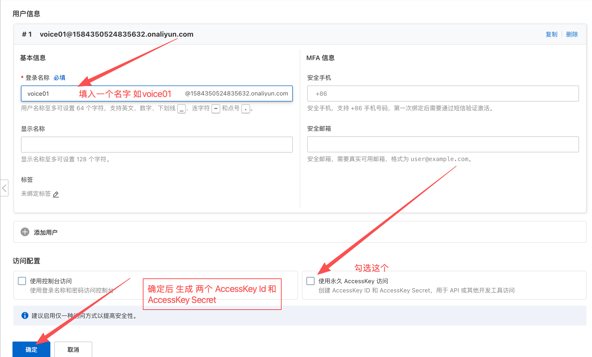

填写用户名（如 `voice-nls`），访问方式勾选「使用永久 AccessKey 访问」，然后点击确定。

按提示完成验证后，会生成 AccessKey ID 和 AccessKey Secret。

**第三步：复制并保存密钥**

> AccessKey Secret 仅显示一次，请立即复制保存！

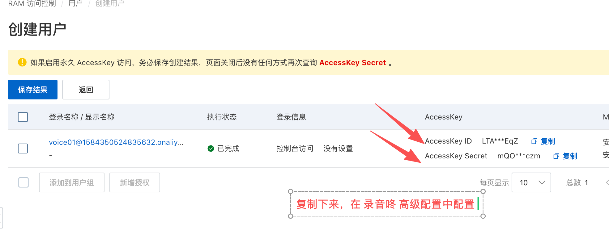

> 这里可能需要身份验证，短信验证码验证一下

**第四步：为子用户授权**

创建完成后，在用户列表中选择新增授权

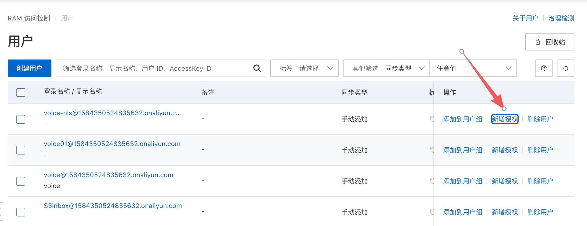

搜索并添加 **`AliyunNLSFullAccess`** 权限（智能语音交互的管理权限）。

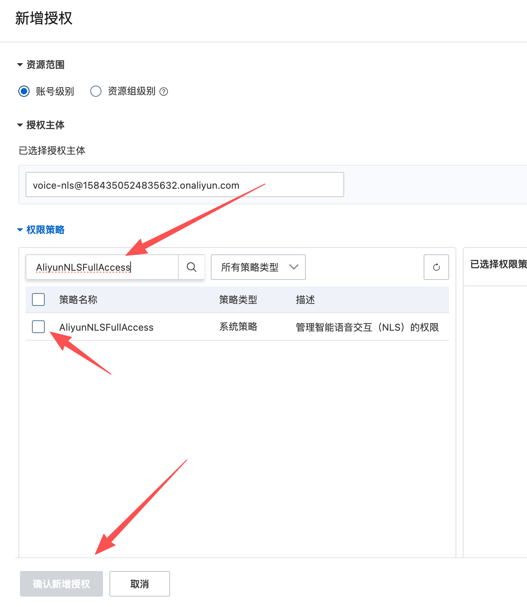

> 安全提示：只授予 `AliyunNLSFullAccess` 即可，遵循最小权限原则。

### 1.3 开通智能语音服务并获取 AppKey

**第一步：进入 NLS 产品页**

访问 [https://ai.aliyun.com/nls](https://ai.aliyun.com/nls)，点击页面上的「管理控制台」入口。

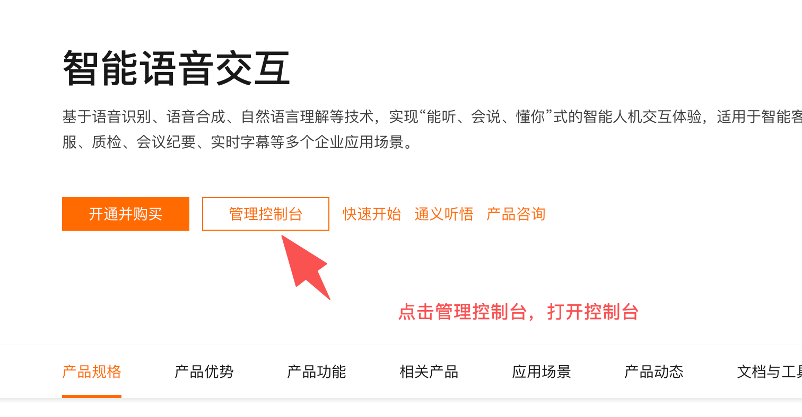

> 如果是首次使用，系统会提示开通服务并完成相关授权。新用户享有 **3 个月免费试用**。

**第二步：创建项目**

进入控制台后，在「项目管理」或「全部项目」页面，点击「创建项目」。

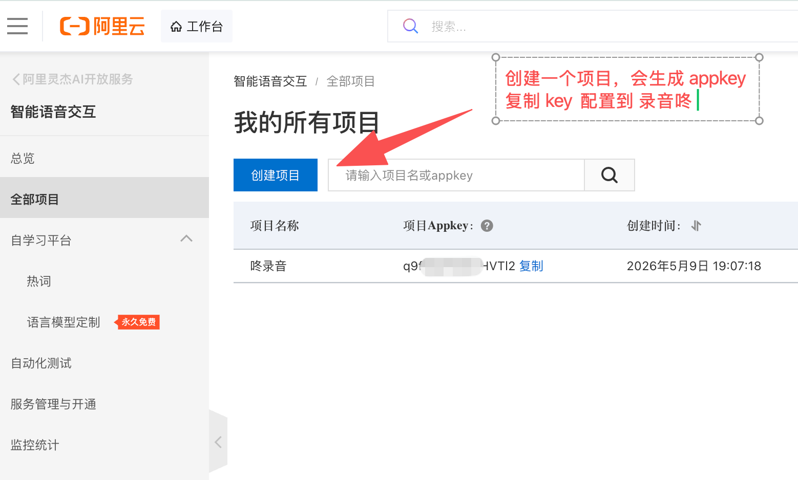

在创建项目表单中：
- **项目名称**：随意填写，如「inVoice 语记」
- **服务类型**：选择「仅语音识别」（我们只需要语音转文字，不需要语音合成）

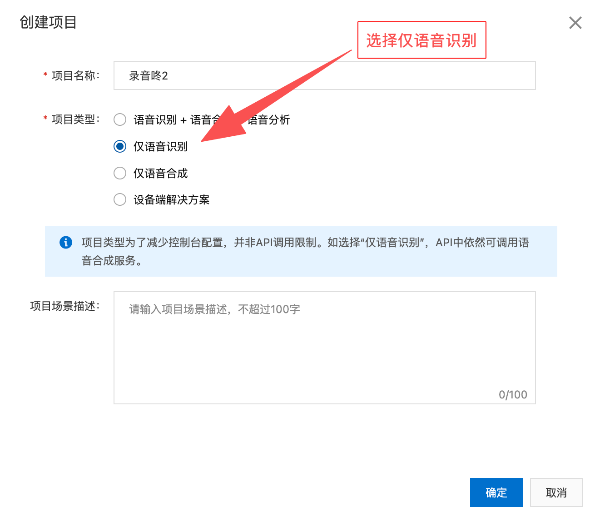

点击确认完成创建。

**第三步：获取 AppKey**

项目创建成功后，在项目列表中可以看到对应的 **AppKey**，将其复制保存。

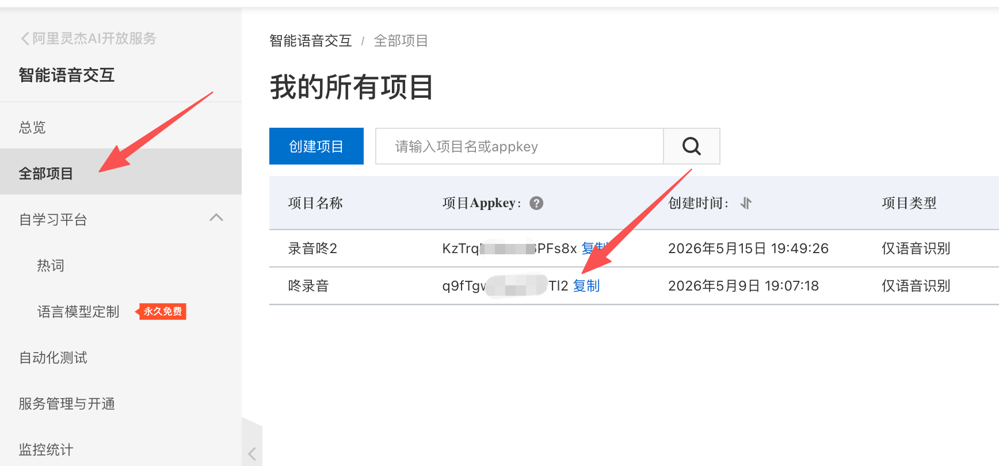

**第四步：开启 录音文件识别（极速版）

完成后，在总览主页还需要开启录音文件识别服务，注意，需要为录音文件识别（极速版）开启商用版本，如下所示：

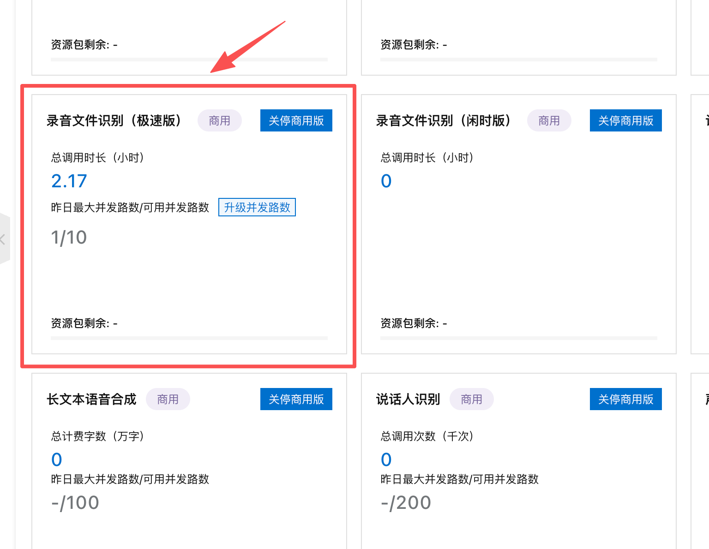

### 1.4 在 App 中填入 NLS 配置

打开 inVoice 语记 App，进入「设置 > 高级配置」，在「语音转写」区域依次填入：

| 字段 | 填写内容 |
|------|----------|
| AccessKey ID | 1.2 步中获取的 AccessKey ID |
| AccessKey Secret | 1.2 步中获取的 AccessKey Secret |
| AppKey | 1.3 步中获取的项目 AppKey |

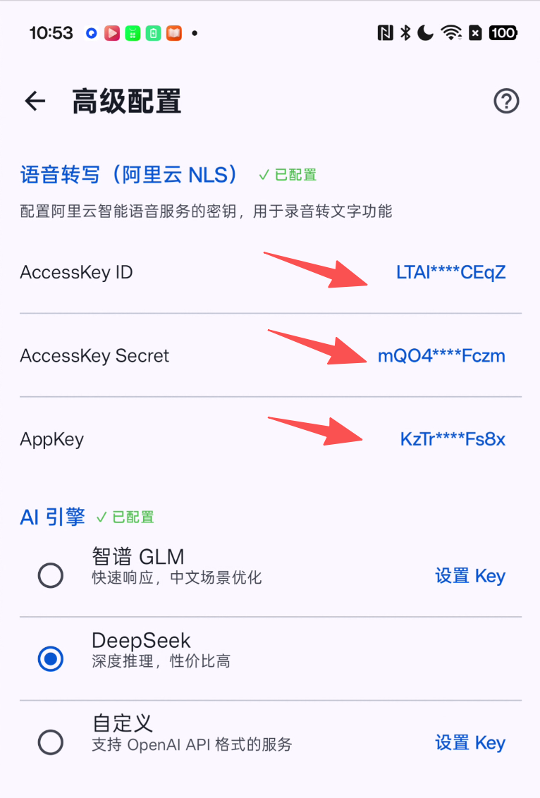

三项都配置完成后，该区域会显示「✓ 已配置」。

---

## 二、配置 AI 引擎

AI 引擎用于录音转写后的文本润色、智能标题等功能。你需要选择一个 AI 服务并获取对应的 API Key。

### 2.1 选择引擎

在「设置 > 高级配置 > AI 引擎」区域，支持以下三种引擎：

| 引擎 | 特点 | 注册地址 |
|------|------|----------|
| **DeepSeek** | 深度推理，性价比高，推荐使用 | [platform.deepseek.com](https://platform.deepseek.com) |
| **智谱 GLM** | 中文场景优化，响应快 | [open.bigmodel.cn](https://open.bigmodel.cn) |
| **自定义** | 支持 OpenAI API 格式的任何服务 | — |

### 2.2 获取 API Key

以 DeepSeek 为例：

1. 访问 [https://platform.deepseek.com](https://platform.deepseek.com)，注册并登录
2. 进入「API Keys」管理页面
3. 点击「创建 API Key」，复制生成的 Key（以 `sk-` 开头）

> DeepSeek 新注册用户会赠送一定额度，日常使用成本极低。

智谱 GLM 的操作类似：登录 [open.bigmodel.cn](https://open.bigmodel.cn)，在 API Keys 页面创建并复制。

### 2.3 在 App 中填入配置

回到「设置 > 高级配置 > AI 引擎」：

1. 选择你要使用的引擎（点击左侧单选按钮）
2. 点击「设置 Key」，粘贴 API Key
3. 如果使用「自定义」引擎，还需要填写 Base URL（如 `https://api.openai.com/v1`）

---

## 三、确认配置完成

在高级配置页面底部，会显示配置状态汇总：

| 状态 | 说明 |
|------|------|
| 已配置 2/2 · 所有服务已配置 | 配置完成，功能可正常使用 |
| 语音转写未配置 | 录音转文字功能不可用 |
| AI 引擎未配置 | AI 润色/标题功能不可用 |

两项都显示已配置后，你就可以正常使用 inVoice 语记的全部功能了。

---

## 费用说明

| 服务 | 费用 |
|------|------|
| 阿里云 NLS | 新用户免费试用 3 个月，之后按量计费。详见[官方计费说明](https://help.aliyun.com/zh/isi/product-overview/billing-10) |
| DeepSeek | 按量计费，价格极低。详见[官方定价](https://platform.deepseek.com/api-docs/pricing) |
| 智谱 GLM | 按量计费，新用户有免费额度。详见[官方定价](https://open.bigmodel.cn/pricing) |

日常录音转写和 AI 处理的用量下，每月费用通常在几元以内。

---

## 常见问题

**Q：配置完成后转写仍然失败？**
检查三项 NLS 配置是否填写正确，特别是 AccessKey Secret 不要包含多余的空格。也可以去阿里云控制台确认服务是否已开通。

**Q：需要用阿里云主账号的 AccessKey 吗？**
不建议。推荐创建专用的 RAM 子用户并只授予 `AliyunNLSFullAccess` 权限，更安全。

**Q：App 更新后需要重新配置吗？**
不需要。配置信息保存在本地，更新 App 不会丢失。但卸载重装需要重新配置。

**Q：可以只配置语音转写，不配 AI 引擎吗？**
可以。语音转写和 AI 功能是独立的，只配一项就能使用对应功能。但建议都配好以获得完整体验。

---

如有其他问题，请查看 [常见问题](qa.md) 或 [联系我们](contact.md)。
