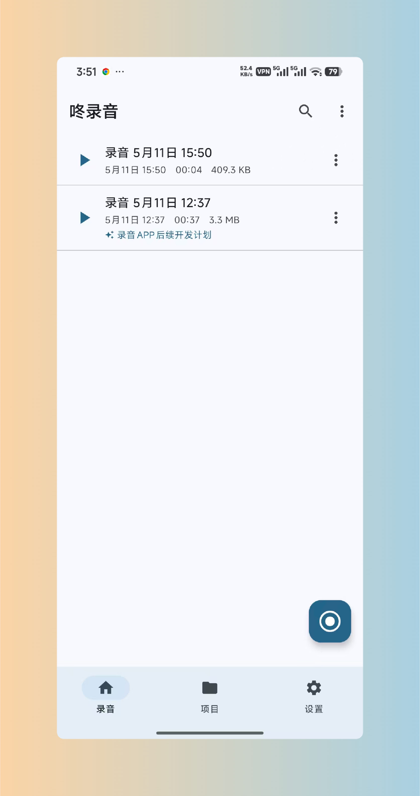

# 录音咚

> 简单好用的录音工具

Voice 是一款简洁、稳定的 Android 录音应用。无论你是记录会议、课堂笔记，还是捕捉灵感，Voice 都能帮你轻松完成高质量的录音，并通过 AI 智能转写让声音变为文字。

## 核心功能

- **高质量录音**：支持多种采样率和声道配置，后台录音不中断
- **智能播放**：变速播放、A-B 循环、书签标记，精确定位每一段内容
- **AI 转写**：支持多个 AI 引擎，录音自动转文字，还能润色和生成摘要
- **项目管理**：用文件夹分类管理录音，支持颜色和图标标记
- **数据安全**：本地存储，支持自动备份和数据导出，数据完全由你掌控
- **快捷录音**：桌面小组件 + 快捷设置磁贴，一键开始录音

## 相关链接

- [快速上手](guide.md)
- [功能详解](features.md)
- [下载安装](download.md)
- [更新日志](changelog.md)
- [常见问题](qa.md)
- [用户协议](agreement.md)
- [隐私政策](privacy.md)
- [联系我们](contact.md)

## 下载

[去下载](download.md)